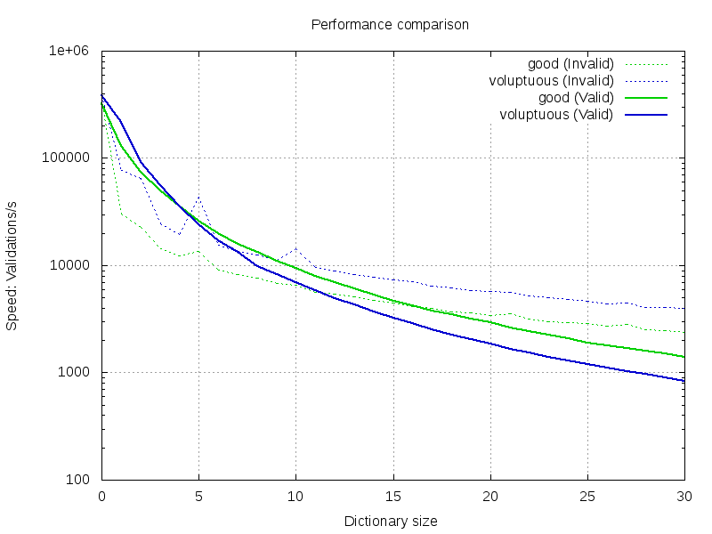
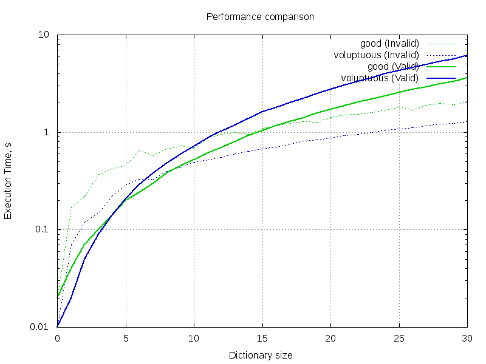

Performance
===========

In this test, we compare the performance of:

* [voluptuous](https://github.com/alecthomas/voluptuous)
* [good](https://github.com/kolypto/py-good)

The [test script](performance.py) generates random dictionary schemas,
increasing its size, and compares how performant both libraries are
on those schemas.

Solid line shows the performance of successful validations.
Dashed line shows the performance of invalid values (raising errors).

Validations Per Second
----------------------

In this test, we compare how many validations per second each of the libraries can do.
A "validation" is an attempt to validate a value against the schema only.

Total Execution Time
--------------------

In this test, we compare how much time a library needs to validate 5000 dictionaries
with a schema.

